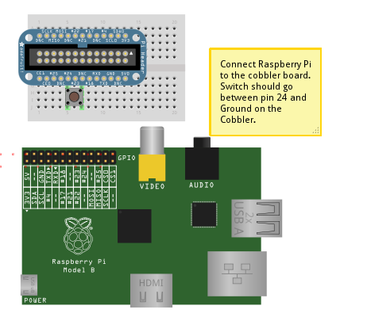

### Camera programming: GPIO pins

1. Build a circuit as per the diagram:
    
2. Double click on `LXTerminal` to start a command line, and enter `sudo idle &` to start the Python environment
3. Select `File > Open > Recent Files > button.py` from the menu to start a text editor
4. You should see the following code (case is important!):

```
#!/usr/bin/python
#####################################################
#### We might need to the program to go to sleep
from time import sleep
#####################################################
#### We need to use the Input pins
import RPi.GPIO as GPIO
prev_state = "unknown"
GPIO.setmode(GPIO.BCM)
GPIO.setup(24, GPIO.IN, pull_up_down=GPIO.PUD_UP)
#####################################################
# This is called an infinite loop. Repeats forever###
while True:
     if GPIO.input(24):
         print ("Button is not pressed")
         sleep(1)
     else:
         print ("Button is pressed")
# Clean up afterwards
GPIO.cleanup()
exit();
```

4. Select `Run > Run Module` from the menu (or just press `F5`) to run the script

***Python Picamera Setup*** by [Dave Jones](https://github.com/waveform80) and the [Raspberry Pi Foundation](http://raspberrypi.org) is licenced under a [Creative Commons Attribution 4.0 International License](http://creativecommons.org/licenses/by-sa/4.0/).

Based on a work at https://github.com/raspberrypilearning/python-picamera-setup
