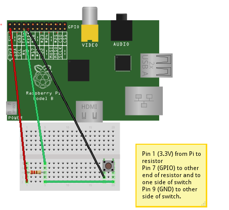

# Scratch Picamera Setup

## Workshop

This workshop guides you through setting up the Raspberry Pi camera module, taking pictures using Scratch, connecting a physical button with the GPIO (General Purpose Input Output) pins and programming it to control the camera.

### Connecting the camera

1. Locate the camera port next to the ethernet port
2. Lift the tab on the top
3. Place the strip in the connector (blue side facing the ethernet port)
4. While holding the strip in place, push down the tab
    
    

### Activate the camera

1. Connect a USB cable to the power
2. Login with username `pi` and password `raspberry`
3. At the command prompt enter `sudo raspi-config`
4. At the menu, navigate to `Enable Camera`
5. Select `Enable`
6. Select `Finish`
7. Select `Yes` to reboot

### Test the camera

1. Double click on `LXTerminal` to start a command line
2. At the command prompt enter `raspistill -o image.jpg`
3. On the screen you should see a preview appear for a few seconds, and then change briefly while the image is captured

### Create the selfies directory

1. Double click on `LXTerminal` to start a command line
2. At the command prompt enter `cd ~/Desktop` to change directory to the Desktop 
3. Create a shortcut (in Raspbian this is known as a Symbolic link) between the photos directory and SELFIES to make it easier to find your selfies `ln -s ../photos SELFIES`
4. A Folder named `SELFIES` should appear on the Desktop

### Connect the circuit board to the Raspberry Pi

1. Connect the circuit board up.

    

2. Double click on `Scratch GPIO 5` icon
    
    

3. Join the blocks together making your photo booth

    

## Licence

Unless otherwise specified, everything in this repository is covered by the following licence:

***Scratch Picamera Setup*** by [Tim Gibbon]

Based on work by Dave Jones at https://github.com/raspberrypilearning/python-picamera-setup
